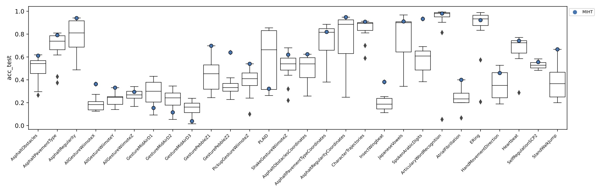
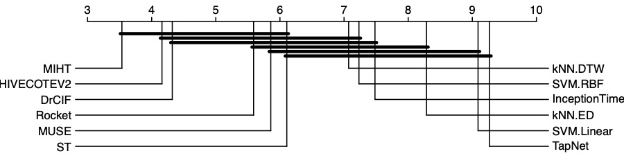

# MIHT: A Hoeffding Tree Algorithm for Time Series Classification using Multiple Instance Learning

Associated repository with complementary materials to the manuscript *MIHT: A Hoeffding Tree Algorithm for Time Series Classification using Multiple Instance Learning* accepted at 26th International Conference on Intelligent Data Engineering and Automated Learning, IDEAL 2025. The following materials are included:

* Source code of the MIHT proposal.
* Datasets used in the experimentation.
* Complete tables of results.
* Complete instructions to execute the model and reproduce the experimentation.

## Source code

The purpose of this repository is to make public and accessible the source code of MIHT. This includes the dependencies of the library and the necessary instructions to use it.

The source code of MIHT is available in the file [src/miht.py](src/miht.py). And a complete tutorial for its execution is presented in the [Quick start notebook](src/tutorial.ipynb).

```python
from miht import MultiInstanceHoeffdingTreeClassifier

miht = MultiInstanceHoeffdingTreeClassifier(
    grace_period=500,
    delta=8.02e-4,
    mil_assumption='mode',
    inst_len=0.6,
    inst_stride=0.4,
    k=2,
    max_it=30,
    max_patience=5,
)
miht.fit(X_train, y_train)
```

## Datasets

MIHT's performance has been validated on a large selection of time-series classification datasets publicly available. All of them belong to the popular [UCR/UEA archive](http://www.timeseriesclassification.com/index.php), using in all the cases the train/test partitions provided by them. The datasets used are:

| Dataset | Vars | Train class dist | Train series | Train avg length | Train std length | Test class dist | Test series | Test avg length | Test std length |
|---|:---:|:---:|:---:|:---:|:---:|:---:|:---:|:---:|:---:|
| [ArrowHead](http://www.timeseriesclassification.com/description.php?Dataset=ArrowHead) | 1 | 0.33/0.33/0.33 | 36 | 251.0 | 0.0 | 0.39/0.3/0.3 | 175 | 251.0 | 0.0 |
| [UnitTest](http://www.timeseriesclassification.com/dataset.php) | 1 | 0.5/0.5 | 20 | 24.0 | 0.0 | 0.55/0.45 | 22 | 24.0 | 0.0 |
| [ArticularyWordRecognition](http://www.timeseriesclassification.com/description.php?Dataset=ArticularyWordRecognition) | 9 | 0.04/0.04/0.04/0.04/0.04/0.04/0.04/0.04/0.04/0.04/0.04/0.04/0.04/0.04/0.04/0.04/0.04/0.04/0.04/0.04/0.04/0.04/0.04/0.04/0.04 | 275 | 144.0 | 0.0 | 0.04/0.04/0.04/0.04/0.04/0.04/0.04/0.04/0.04/0.04/0.04/0.04/0.04/0.04/0.04/0.04/0.04/0.04/0.04/0.04/0.04/0.04/0.04/0.04/0.04 | 300 | 144.0 | 0.0 |
| [AtrialFibrillation](http://www.timeseriesclassification.com/description.php?Dataset=AtrialFibrillation) | 2 | 0.33/0.33/0.33 | 15 | 640.0 | 0.0 | 0.33/0.33/0.33 | 15 | 640.0 | 0.0 |
| [BasicMotions](http://www.timeseriesclassification.com/description.php?Dataset=BasicMotions) | 6 | 0.25/0.25/0.25/0.25 | 40 | 100.0 | 0.0 | 0.25/0.25/0.25/0.25 | 40 | 100.0 | 0.0 |
| [Cricket](http://www.timeseriesclassification.com/description.php?Dataset=Cricket) | 6 | 0.08/0.08/0.08/0.08/0.08/0.08/0.08/0.08/0.08/0.08/0.08/0.08 | 108 | 1197.0 | 0.0 | 0.08/0.08/0.08/0.08/0.08/0.08/0.08/0.08/0.08/0.08/0.08/0.08 | 72 | 1197.0 | 0.0 |
| [DuckDuckGeese](http://www.timeseriesclassification.com/description.php?Dataset=DuckDuckGeese) | 1345 | 0.2/0.2/0.2/0.2/0.2 | 50 | 270.0 | 0.0 | 0.2/0.2/0.2/0.2/0.2 | 50 | 270.0 | 0.0 |
| [EigenWorms](http://www.timeseriesclassification.com/description.php?Dataset=EigenWorms) | 6 | 0.43/0.17/0.13/0.17/0.09 | 128 | 17984.0 | 0.0 | 0.42/0.17/0.14/0.18/0.1 | 131 | 17984.0 | 0.0 |
| [FingerMovements](http://www.timeseriesclassification.com/description.php?Dataset=FingerMovements) | 28 | 0.5/0.5 | 316 | 50.0 | 0.0 | 0.49/0.51 | 100 | 50.0 | 0.0 |
| [Heartbeat](http://www.timeseriesclassification.com/description.php?Dataset=Heartbeat) | 61 | 0.72/0.28 | 204 | 405.0 | 0.0 | 0.72/0.28 | 205 | 405.0 | 0.0 |
| [MotorImagery](http://www.timeseriesclassification.com/description.php?Dataset=MotorImagery) | 64 | 0.5/0.5 | 278 | 3000.0 | 0.0 | 0.5/0.5 | 100 | 3000.0 | 0.0 |
| [SelfRegulationSCP1](http://www.timeseriesclassification.com/description.php?Dataset=SelfRegulationSCP1) | 6 | 0.5/0.5 | 268 | 896.0 | 0.0 | 0.5/0.5 | 293 | 896.0 | 0.0 |
| [SelfRegulationSCP2](http://www.timeseriesclassification.com/description.php?Dataset=SelfRegulationSCP2) | 7 | 0.5/0.5 | 200 | 1152.0 | 0.0 | 0.5/0.5 | 180 | 1152.0 | 0.0 |
| [StandWalkJump](http://www.timeseriesclassification.com/description.php?Dataset=StandWalkJump) | 4 | 0.33/0.33/0.33 | 12 | 2500.0 | 0.0 | 0.33/0.33/0.33 | 15 | 2500.0 | 0.0 |
| [AsphaltRegularity](http://www.timeseriesclassification.com/description.php?Dataset=AsphaltRegularity) | 1 | 0.49/0.51 | 751 | 387.1 | 252.33 | 0.49/0.51 | 751 | 380.9 | 205.6 |
| [AllGestureWiimoteX](http://www.timeseriesclassification.com/description.php?Dataset=AllGestureWiimoteX) | 1 | 0.1/0.1/0.1/0.1/0.1/0.1/0.1/0.1/0.1/0.1 | 300 | 124.9 | 65.88 | 0.1/0.1/0.1/0.1/0.1/0.1/0.1/0.1/0.1/0.1 | 700 | 124.7 | 68.9 |
| [AllGestureWiimoteY](http://www.timeseriesclassification.com/description.php?Dataset=AllGestureWiimoteY) | 1 | 0.1/0.1/0.1/0.1/0.1/0.1/0.1/0.1/0.1/0.1 | 300 | 128.6 | 69.61 | 0.1/0.1/0.1/0.1/0.1/0.1/0.1/0.1/0.1/0.1 | 700 | 123.1 | 67.2 |
| [AllGestureWiimoteZ](http://www.timeseriesclassification.com/description.php?Dataset=AllGestureWiimoteZ) | 1 | 0.1/0.1/0.1/0.1/0.1/0.1/0.1/0.1/0.1/0.1 | 300 | 125.5 | 66.31 | 0.1/0.1/0.1/0.1/0.1/0.1/0.1/0.1/0.1/0.1 | 700 | 124.4 | 68.7 |
| [GesturePebbleZ2](http://www.timeseriesclassification.com/description.php?Dataset=GesturePebbleZ2) | 1 | 0.17/0.16/0.16/0.16/0.16/0.18 | 146 | 223.5 | 88.7 | 0.15/0.14/0.19/0.18/0.18/0.16 | 158 | 215.4 | 60.0 |
| [PickupGestureWiimoteZ](http://www.timeseriesclassification.com/description.php?Dataset=PickupGestureWiimoteZ) | 1 | 0.1/0.1/0.1/0.1/0.1/0.1/0.1/0.1/0.1/0.1 | 50 | 145.9 | 78.09 | 0.1/0.1/0.1/0.1/0.1/0.1/0.1/0.1/0.1/0.1 | 50 | 145.5 | 69.0 |
| [AsphaltObstaclesCoordinates](http://www.timeseriesclassification.com/description.php?Dataset=AsphaltObstaclesCoordinates) | 3 | 0.21/0.24/0.27/0.28 | 390 | 297.8 | 114.75 | 0.2/0.24/0.27/0.28 | 391 | 299.5 | 114.2 |
| [AsphaltRegularityCoordinates](http://www.timeseriesclassification.com/description.php?Dataset=AsphaltRegularityCoordinates) | 3 | 0.49/0.51 | 751 | 387.1 | 252.33 | 0.49/0.51 | 751 | 380.9 | 205.6 |
| [InsectWingbeat](http://www.timeseriesclassification.com/description.php?Dataset=InsectWingbeat) | 200 | 0.1/0.1/0.1/0.1/0.1/0.1/0.1/0.1/0.1/0.1 | 25000 | 6.7 | 1.6 | 0.1/0.1/0.1/0.1/0.1/0.1/0.1/0.1/0.1/0.1 | 25000 | 6.7 | 1.6 |
| [JapaneseVowels](http://www.timeseriesclassification.com/description.php?Dataset=JapaneseVowels) | 12 | 0.11/0.11/0.11/0.11/0.11/0.11/0.11/0.11/0.11 | 270 | 15.8 | 3.59 | 0.08/0.09/0.24/0.12/0.08/0.06/0.11/0.14/0.08 | 370 | 15.4 | 3.6 |
| [SpokenArabicDigits](http://www.timeseriesclassification.com/description.php?Dataset=SpokenArabicDigits) | 13 | 0.1/0.1/0.1/0.1/0.1/0.1/0.1/0.1/0.1/0.1 | 6599 | 39.9 | 8.72 | 0.1/0.1/0.1/0.1/0.1/0.1/0.1/0.1/0.1/0.1 | 2199 | 39.6 | 8.0 |

## Results

The average results across in test for all the studied metrics are:

| Model      | Accuracy | Balanced accuracy | Macro-F1 | Micro-F1 | Hamming loss | Total execution time (segs) | Train execution time (segs) | Test execution time (segs) | Memory (MB) |
|---------------|----------|-------------------|---------------|---------------|--------------|-------------------|-------------------|------------------|-----------|
| MIHT          | **0.5967**   | **0.5820**            | **0.5706**        | **0.5967**        | **0.4033**       | 129628.4435       | 129249.1569       | 379.2866         | 320.6287  |
| DrCIF         | 0.5470   | 0.5358            | 0.5298        | 0.5470        | 0.4530       | 1186.0192         | 1090.4306         | 95.5886          | 6.7678    |
| ST            | 0.5225   | 0.5092            | 0.5009        | 0.5225        | 0.4775       | 4609.3028         | 4590.7299         | 18.5730          | 28.2486   |
| MUSE          | 0.5198   | 0.5069            | 0.4983        | 0.5198        | 0.4802       | 93.9499           | 85.5319           | 8.4179           | 11.3892   |
| Rocket        | 0.5416   | 0.5303            | 0.5215        | 0.5416        | 0.4584       | 653.9174          | 626.9591          | 26.9582          | **2.8780**    |
| SVM-Linear    | 0.3307   | 0.3304            | 0.2763        | 0.3307        | 0.6693       | 5938.1644         | 3320.9228         | 2617.2416        | 14.5350   |
| SVM-RBF       | 0.4831   | 0.4659            | 0.4204        | 0.4831        | 0.5169       | 11235.0607        | 5948.1875         | 5286.8732        | 14.5353   |
| kNN-ED        | 0.3966   | 0.3889            | 0.3668        | 0.3966        | 0.6034       | 12457.1701        | 0.2014            | 12456.9687       | 206.7381  |
| kNN-DTW       | 0.4821   | 0.4732            | 0.4649        | 0.4821        | 0.5179       | 167.4229          | **0.1408**            | 167.2821         | 198.6305  |
| TapNet        | 0.3317   | 0.3315            | 0.2970        | 0.3317        | 0.6683       | 67.3836           | 66.5759           | 0.8077           | 134.6812  |
| InceptionTime | 0.3821   | 0.3800            | 0.3525        | 0.3821        | 0.6179       | **28.9667**           | 28.4903           | **0.4764**           | 127.6734  |
| HIVECOTEV2    | 0.5449   | 0.5296            | 0.5212        | 0.5449        | 0.4551       | 14025.4362        | 13429.3408        | 596.0954         | 874.8151  |

In particular, the main metric studied, the accuracy obtained in test, is the following:

| Dataset                        | MIHT   | DrCIF  | ST     | MUSE   | Rocket | SVM-Linear | SVM-RBF | kNN-ED | kNN-DTW | TapNet | InceptionTime | HIVECOTEV2 |
|--------------------------------|--------|--------|--------|--------|--------|------------|---------|--------|---------|--------|---------------|------------|
| AsphaltObstacles               | 0.6113 | 0.6087 | 0.5448 | 0.5550 | 0.5396 | 0.2660     | 0.3555  | 0.2967 | 0.4885  | 0.5217 | 0.5448        | **0.6189**     |
| AsphaltPavementType            | **0.7907** | 0.7850 | 0.7311 | 0.6875 | 0.6790 | 0.3741     | 0.7453  | 0.4280 | 0.6174  | 0.7879 | 0.8097        | 0.7813     |
| AsphaltRegularity              | 0.9401 | 0.9174 | 0.8708 | 0.7324 | 0.7483 | 0.5140     | 0.9161  | 0.4874 | 0.7497  | 0.5486 | **0.9414**        | 0.9148     |
| AllGestureWiimoteX             | **0.3629** | 0.2129 | 0.1371 | 0.1257 | 0.1371 | 0.1300     | 0.2729  | 0.1929 | 0.1971  | 0.1743 | 0.1714        | 0.2086     |
| AllGestureWiimoteY             | **0.3314** | 0.2543 | 0.1400 | 0.1500 | 0.2357 | 0.1714     | 0.2429  | 0.2529 | 0.2500  | 0.2500 | 0.1900        | 0.2543     |
| AllGestureWiimoteZ             | 0.2943 | **0.3414** | 0.2486 | 0.2400 | 0.2586 | 0.1671     | 0.2371  | 0.2786 | 0.3157  | 0.2357 | 0.2786        | 0.3200     |
| GestureMidAirD1                | 0.1538 | 0.3692 | 0.3692 | 0.4077 | 0.4077 | 0.0923     | 0.1308  | 0.2538 | 0.2231  | 0.3154 | 0.2846        | **0.4308**     |
| GestureMidAirD2                | 0.1154 | **0.3462** | 0.2615 | 0.2846 | 0.2846 | 0.0538     | 0.1000  | 0.2000 | 0.2154  | 0.2308 | 0.2538        | 0.3154     |
| GestureMidAirD3                | 0.0385 | 0.1846 | 0.2231 | 0.1923 | 0.2077 | 0.0154     | 0.1154  | 0.1231 | 0.1077  | 0.1385 | 0.1846        | **0.2385**     |
| GesturePebbleZ1                | **0.6977** | 0.5291 | 0.4593 | 0.5349 | 0.4477 | 0.4477     | 0.5988  | 0.3140 | 0.3198  | 0.2558 | 0.2442        | 0.4826     |
| GesturePebbleZ2                | **0.6392** | 0.3165 | 0.3734 | 0.3671 | 0.3481 | 0.4177     | 0.3101  | 0.2595 | 0.2722  | 0.3165 | 0.2278        | 0.3608     |
| PickupGestureWiimoteZ          | **0.5400** | **0.5400** | 0.4600 | 0.4000 | 0.3200 | 0.3600     | 0.4200  | 0.4600 | 0.4000  | 0.2400 | 0.1000        | 0.4600     |
| PLAID                          | 0.3222 | 0.7784 | 0.7858 | 0.8510 | 0.8268 | 0.2626     | 0.2905  | 0.5475 | **0.8547**  | 0.2980 | 0.4786        | 0.8417     |
| ShakeGestureWiimoteZ           | 0.6200 | 0.5800 | 0.5800 | 0.5600 | 0.5200 | 0.4400     | **0.6800**  | 0.6200 | 0.5000  | 0.2200 | 0.3200        | 0.5200     |
| AsphaltObstaclesCoordinates    | **0.6240** | 0.5729 | 0.5703 | 0.5090 | 0.6010 | 0.2839     | 0.4271  | 0.2583 | 0.4169  |        |               | 0.6010     |
| AsphaltPavementTypeCoordinates | 0.8191 | **0.8712** | 0.8163 | 0.8059 | 0.8267 | 0.3807     | 0.7822  | 0.4489 | 0.5360  |        | 0.8854        | 0.8684     |
| AsphaltRegularityCoordinates   | **0.9481** | 0.9374 | 0.8921 | 0.8855 | 0.8762 | 0.5007     | 0.9121  | 0.2477 | 0.5819  | 0.6778 |               | 0.9467     |
| CharacterTrajectories          | 0.9081 | 0.8948 | 0.8538 | 0.8795 | 0.8948 | 0.5891     | 0.9004  | 0.6999 | **0.9123**  | 0.8106 |               | 0.8997     |
| InsectWingbeat                 | **0.3814** |        |        | 0.2218 | 0.1871 | 0.1257     | 0.1128  | 0.1649 | 0.2536  |        |               |            |
| JapaneseVowels                 | 0.9108 | 0.9000 | 0.5676 | 0.4351 | 0.8730 | 0.9568     | **0.9676**  | 0.3432 | 0.9000  |        |               | 0.9000     |
| SpokenArabicDigits             | **0.9332** |        | 0.3838 | 0.6085 | 0.6362 | 0.5239     | 0.4834  | 0.4861 | 0.6521  |        | 0.6908        |            |
| ArticularyWordRecognition      | 0.9800 | 0.9800 | 0.9667 | **0.9933** | **0.9933** | 0.0533     | 0.8133  | 0.9700 | 0.9867  | 0.9033 | 0.9867        | **0.9933**     |
| AtrialFibrillation             | **0.4000** | 0.2000 | 0.2667 | 0.2000 | 0.0667 | 0.3333     | 0.2667  | 0.2667 | 0.2000  | 0.2000 | 0.3333        | 0.2000     |
| ERing                          | 0.9222 | **0.9889** | 0.9519 | 0.9593 | 0.9815 | 0.2074     | 0.8333  | 0.9444 | 0.9148  | 0.5741 | 0.8889        | **0.9889**     |
| HandMovementDirection          | 0.4595 | **0.4865** | 0.3919 | 0.2432 | 0.5270 | 0.3108     | 0.1892  | 0.2568 | 0.1892  | 0.2432 | 0.4054        | 0.4730     |
| Heartbeat                      | 0.7415 | **0.7707** | 0.7463 | 0.7415 | 0.7463 | 0.2878     | 0.7220  | 0.6195 | 0.7171  | 0.5854 | 0.6390        | 0.7268     |
| SelfRegulationSCP2             | 0.5556 | 0.5500 | 0.5056 | 0.5833 | 0.5278 | 0.5278     | 0.5000  | 0.4833 | 0.5278  | 0.4944 | 0.5056        | **0.5778**     |
| StandWalkJump                  | **0.6667** | 0.4000 | 0.5333 | 0.4000 | 0.4667 | 0.4667     | 0.2000  | 0.2000 | 0.2000  | 0.2667 | 0.3333        | 0.3333     |
| | | | | | | | | | | | | |
| *Average* | **0.5967** | 0.5470 | 0.5225 | 0.5198 | 0.5416 | 0.3307     | 0.4831  | 0.3966 | 0.4821  | 0.3317 | 0.3821        | 0.5449     |
| *Friedman's rank* | **3.5357** | 4.3214 | 6.1071 | 5.8571 | 5.5893 | 9.0893 | 7.2321 | 8.2857 | 7.0714 | 9.2679 | 7.4821 | 4.1607 |

Moreover, the results are summarized in the following graphs for both accuracy and time of execution (considering both train and test times in seconds). These graphs show the distribution per dataset of the tested models and at which point is our proposed MLHT.



The raw measures per model and dataset have been used to find statistically significant differences between the studied methods. Specifically we use the Friedman test of the ranks of the metrics and the post-hoc Bonferroni-Dumm test to find the pair of groups which are significantly different.

We have use R and its [scmamp](https://github.com/b0rxa/scmamp) library in the following way:

```R
library(scmamp)

# Load raw data
rd <- read.csv(csv_path)
nAlgorithms <- ncol(rd)-1
nDatasets <- nrow(rd)
rdm <- rd[, 2: (nAlgorithms+1)]
# Friedman test. Multiple comparison
alpha <- 0.01
friedman <- friedmanTest(data=rdm,alpha=alpha)
if(friedman$p.value < alpha) {
    # Post-Hoc test
    test <- postHocTest(data=rdm, test='friedman', correct='bonferroni', alpha=alpha, use.rank=FALSE, sum.fun=mean)
}
```

And the critical distance plot is:



The complete results of the experimentation carried out in this work and presented and discussed in the associated paper are available in CSV format for download in the [results folder](results/) attending to the metrics:

| Metric | File |
|---|---|
|Accuracy in train | [acc_train.csv](results/acc_train.csv) |
|Accuracy in test | [acc_test.csv](results/acc_test.csv) |
|Execution time (seconds) in train | [exec_time_s_train.csv](results/exec_time_s_train.csv) |
|Execution time (seconds) in test | [exec_time_s_test.csv](results/exec_time_s_test.csv) |
|Size of the generated model (MB) | [memory_mb.csv](results/memory_mb.csv) |

## Reproductible experimentation

All the experimentation has been run in Python, using for the comparative analysis the implementations available in [Sktime](https://www.sktime.net/en/stable/) of the main time series classification methods, with the default parameters proposed by the authors. The methods used, their parameters and the reference implementation used are detailed below.

| Method | Family | Parameters | Implementation reference |
|---|---|---|---|
| MIHT | Multi-instance learning + incremental decision tree | `mil_assumption=mode`,`inst_len=0.4688`, `inst_stride=0.3039`, `k=4`, `grace_period=582`, `delta=2.508e-6`,`iters=30`, `patience=5`, `reset_model=False` | This repository |
| DrCif | Feature-based | `n_estimators=200`, `n_intervals=None`, `att_subsample_size=10`, `min_interval=4`, `max_interval=None`, `base_estimator='CIT'`, `time_limit_in_minutes=0.0`, `contract_max_n_estimators=500`, `save_transformed_data=False`, `n_jobs=1`, `random_state=None` | [DrCif in Sktime](https://www.sktime.net/en/latest/api_reference/auto_generated/sktime.classification.interval_based.DrCIF.html#sktime.classification.interval_based.DrCIF) |
| ST | Shapelet-based | `n_shapelet_samples=10000`, `max_shapelets=None`, `max_shapelet_length=None`, `estimator=ContinuousIntervalTree()`, `transform_limit_in_minutes=0`, `time_limit_in_minutes=0`, `contract_max_n_shapelet_samples=inf`, `save_transformed_data=False`, `n_jobs=1`, `batch_size=100`, `random_state=None` | [ShapeletTransformClassifier in Sktime](https://www.sktime.net/en/latest/api_reference/auto_generated/sktime.classification.shapelet_based.ShapeletTransformClassifier.html) |
| MUSE | Dictionary-based | `anova=True`, `variance=False`, `bigrams=True`, `window_inc=2`, `alphabet_size=4`, `use_first_order_differences=True`, `feature_selection='chi2'`, `p_threshold=0.05`, `support_probabilities=False`, `n_jobs=1`, `random_state=None` | [MUSE in Sktime](https://www.sktime.net/en/latest/api_reference/auto_generated/sktime.classification.dictionary_based.MUSE.html) |
| ROCKET | Convolutional-based | `num_kernels=10000`, `rocket_transform='rocket'`, `max_dilations_per_kernel=32`, `n_features_per_kernel=4`, `use_multivariate='auto'`, `n_jobs=1`, `random_state=None` | [RocketClassifier in Sktime](https://www.sktime.net/en/stable/api_reference/auto_generated/sktime.classification.kernel_based.RocketClassifier.html) |
| HIVECOTE2 | Hybrid | `stc_params={'estimator': ContinuousIntervalTree()}`, `drcif_params={'n_estimators': 1}`, `arsenal_params={'n_estimators': 10, 'num_kernels': 100, 'rocket_transform': 'rocket'}`, `tde_params={'max_ensemble_size': 10}`, `time_limit_in_minutes=0`, `save_component_probas=False`, `verbose=0`, `n_jobs=1`, `random_state=None` | [HIVECOTEV2 in Sktime](https://www.sktime.net/en/stable/api_reference/auto_generated/sktime.classification.hybrid.HIVECOTEV2.html) |
| SVM-Linear | Kernel-based | `kernel=AggrDist(PairwiseKernel(metric='linear'))`, `kernel_params=None`, `kernel_mtype=None`, `C=1`, `shrinking=True`, `probability=False`, `tol=0.001`, `cache_size=200`, `class_weight=None`, `verbose=False`, `max_iter=30`, `decision_function_shape='ovr'`, `break_ties=False`, `random_state=None` | [TimeSeriesSVC in Sktime](https://www.sktime.net/en/latest/api_reference/auto_generated/sktime.classification.kernel_based.TimeSeriesSVC.html) |
| SVM-RBF | Kernel-based | `kernel=AggrDist(PairwiseKernel(metric='rbf'))`, `kernel_params=None`, `kernel_mtype=None`, `C=1`, `shrinking=True`, `probability=False`, `tol=0.001`, `cache_size=200`, `class_weight=None`, `verbose=False`, `max_iter=30`, `decision_function_shape='ovr'`, `break_ties=False`, `random_state=None` | [TimeSeriesSVC in Sktime](https://www.sktime.net/en/latest/api_reference/auto_generated/sktime.classification.kernel_based.TimeSeriesSVC.html) |
| kNN-ED | Distance-based | `n_neighbors=1`, `weights='uniform'`, `algorithm='brute'`, `distance=DistFromAligner(AlignerDTW(dist_method='euclidean'))`, `distance_params=None`, `distance_mtype=None`, `pass_train_distances=False`, `leaf_size=30`, `n_jobs=None` | [KNeighborsTimeSeriesClassifier in Sktime](https://www.sktime.net/en/latest/api_reference/auto_generated/sktime.classification.distance_based.KNeighborsTimeSeriesClassifier.html) |
| kNN-DTW | Distance-based | `n_neighbors=1`, `weights='uniform'`, `algorithm='brute'`, `distance=DistFromAligner(AlignerDTWfromDist(DtwDist(weighted=False, derivative=False)))`, `distance_params=None`, `distance_mtype=None`, `pass_train_distances=False`, `leaf_size=30`, `n_jobs=None` | [KNeighborsTimeSeriesClassifier in Sktime](https://www.sktime.net/en/latest/api_reference/auto_generated/sktime.classification.distance_based.KNeighborsTimeSeriesClassifier.html) |
| TapNet | Deep learning | `n_epochs=500`, `batch_size=16`, `dropout=0.5`, `filter_sizes=(256, 256, 128)`, `kernel_size=(8, 5, 3)`, `dilation=1`, `layers=(500, 300)`, `use_rp=True`, `rp_params=(-1, 3)`, `activation='sigmoid'`, `use_bias=True`, `use_att=True`, `use_lstm=True`, `use_cnn=True`, `random_state=None`, `padding='same'`, `loss='binary_crossentropy'`, `optimizer=None`, `metrics=None`, `callbacks=None`, `verbose=False` | [TapNetClassifier in Sktime](https://www.sktime.net/en/latest/api_reference/auto_generated/sktime.classification.deep_learning.TapNetClassifier.html) |
| InceptionTime | Deep learning | `n_epochs=500`, `batch_size=64`, `kernel_size=40`, `n_filters=32`, `use_residual=True`, `use_bottleneck=True`, `bottleneck_size=32`, `depth=6`, `callbacks=None`, `random_state=None`, `verbose=False`, `loss='categorical_crossentropy'`, `metrics=None` | [InceptionTimeClassifier in Sktime](https://www.sktime.net/en/stable/api_reference/auto_generated/sktime.classification.deep_learning.InceptionTimeClassifier.html) |
