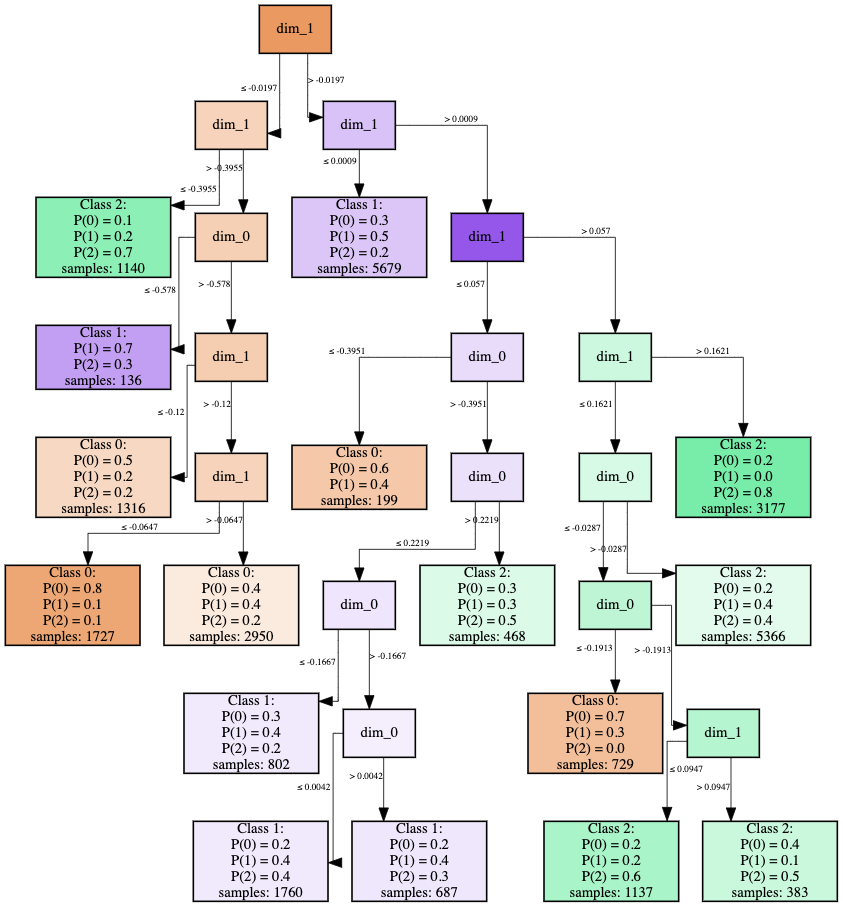

# Interpretability in MLHT

Bellow it is shown the size of the base tree generated for MIHT for each of the datasets considered in the study, in term of height of the tree, number of nodes in total, and broken down by branche nodes and leaf nodes.

| Dataset                      | height | # nodes | # branches | # leaves |
|------------------------------|--------|---------|------------|----------|
| ArrowHead                    | 8      | 39      | 19         | 20       |
| UnitTest                     | 4      | 9       | 4          | 5        |
| ArticularyWordRecognition    | 6      | 21      | 10         | 11       |
| AtrialFibrillation           | 13     | 143     | 71         | 72       |
| BasicMotions                 | 4      | 11      | 5          | 6        |
| Cricket                      | 14     | 197     | 98         | 99       |
| DuckDuckGeese                | 11     | 107     | 53         | 54       |
| EigenWorms                   | 26     | 3469    | 1734       | 1735     |
| FingerMovements              | 23     | 465     | 232        | 233      |
| Heartbeat                    | 3      | 7       | 3          | 4        |
| MotorImagery                 | 28     | 10701   | 5350       | 5351     |
| SelfRegulationSCP1           | 33     | 10715   | 5357       | 5358     |
| SelfRegulationSCP2           | 29     | 3787    | 1893       | 1894     |
| StandWalkJump                | 21     | 205     | 102        | 103      |
| AsphaltRegularity            | 23     | 2055    | 1027       | 1028     |
| AllGestureWiimoteX           | 15     | 281     | 140        | 141      |
| AllGestureWiimoteY           | 13     | 201     | 100        | 101      |
| AllGestureWiimoteZ           | 14     | 217     | 108        | 109      |
| GesturePebbleZ2              | 24     | 903     | 451        | 452      |
| PickupGestureWiimoteZ        | 11     | 77      | 38         | 39       |
| AsphaltObstaclesCoordinates  | 30     | 227     | 113        | 114      |
| AsphaltRegularityCoordinates | 42     | 7691    | 3845       | 3846     |
| InsectWingbeat               | 32     | 163     | 81         | 82       |
| JapaneseVowels               | 6      | 23      | 11         | 12       |
| SpokenArabicDigits           | 24     | 1731    | 865        | 866      |

We can also visualizate the generated tree for a model graphically with the code:

```python
from miht import MultiInstanceHoeffdingTreeClassifier

model = MultiInstanceHoeffdingTreeClassifier()
model.online_learner.draw()
```

For example, for the dataset *AtrialFribrilation* we get the following tree. In the leaves we see the probability of each class an how many time steps were received during the training process using the iterative search based on the MIL framework. In the branchs we see the attribute and the values of it that define the split. In this specific example, the structure of the tree also shows us that the most discriminant feature is *dim_1*, since it is in the root node and is prevalent in the higher levels, while *dim_0* is used in the lower levels of the tree when the path has discriminated the data with more important conditions.


