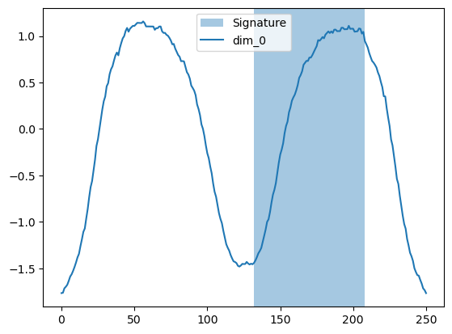

# Interpretability in MLHT

Bellow it is shown the size of the base tree generated for MIHT for each of the datasets considered in the study, in term of height of the tree, number of nodes in total, and broken down by branche nodes and leaf nodes.

| Dataset                      | height | # nodes | # branches | # leaves |
|------------------------------|-------:|--------:|-----------:|---------:|
| ArrowHead                    | 8      | 39      | 19         | 20       |
| UnitTest                     | 4      | 9       | 4          | 5        |
| ArticularyWordRecognition    | 6      | 21      | 10         | 11       |
| AtrialFibrillation           | 8      | 31      | 15         | 16       |
| BasicMotions                 | 4      | 11      | 5          | 6        |
| Cricket                      | 14     | 197     | 98         | 99       |
| DuckDuckGeese                | 11     | 107     | 53         | 54       |
| EigenWorms                   | 26     | 3469    | 1734       | 1735     |
| FingerMovements              | 23     | 465     | 232        | 233      |
| Heartbeat                    | 3      | 7       | 3          | 4        |
| MotorImagery                 | 28     | 10701   | 5350       | 5351     |
| SelfRegulationSCP1           | 33     | 10715   | 5357       | 5358     |
| SelfRegulationSCP2           | 29     | 3787    | 1893       | 1894     |
| StandWalkJump                | 21     | 205     | 102        | 103      |
| AsphaltRegularity            | 23     | 2055    | 1027       | 1028     |
| AllGestureWiimoteX           | 15     | 281     | 140        | 141      |
| AllGestureWiimoteY           | 13     | 201     | 100        | 101      |
| AllGestureWiimoteZ           | 14     | 217     | 108        | 109      |
| GesturePebbleZ2              | 24     | 903     | 451        | 452      |
| PickupGestureWiimoteZ        | 11     | 77      | 38         | 39       |
| AsphaltObstaclesCoordinates  | 30     | 227     | 113        | 114      |
| AsphaltRegularityCoordinates | 42     | 7691    | 3845       | 3846     |
| InsectWingbeat               | 32     | 163     | 81         | 82       |
| JapaneseVowels               | 6      | 23      | 11         | 12       |
| SpokenArabicDigits           | 24     | 1731    | 865        | 866      |

We can also visualizate the generated tree for a model graphically with the code:

```python
from miht import MultiInstanceHoeffdingTreeClassifier

model = MultiInstanceHoeffdingTreeClassifier()
model.online_learner.draw()
```

For example, for the dataset *AtrialFribrilation* we get the following tree. In the leaves we see the probability of each class an how many time steps were received during the training process using the iterative search based on the MIL framework. In the branchs we see the attribute and the values of it that define the split. In this specific example, the structure of the tree also shows us that the most discriminant feature is *dim_1*, since it is in the root node and is prevalent in the higher levels, while *dim_0* is used in the lower levels of the tree when the path has discriminated the data with more important conditions.


Finally, we can also visualize a time series and the instance that maximize the likelihood of the predicted class. Continuing with the dataset of the previous example, *AtrialFribrilation* we can visualize 3 random series of the test set, one for each class, with the section that has been highlighted as the most relevant in each case (signature).

* Class *n*: the most informative window is between the time steps 340 and the 510 approx for this series.


* Class *s*: the most informative window is between the time steps 190 and the 370 approx for this series.


* Class *t*: the most informative window is between the time steps 340 and the 510 approx for this series.


Other examples for other datasets are:

* *BasicMotions*:

|Class *standing* | Class *badminton*|
|:---:|:---:|
| | |

* *ArrowHead*

| Class 0 | Class 1 | Class 2|
|:---:|:---:|:---:|
|  |  |  |

* *Cricket*:

|Class 4 | Class 9|
|:---:|:---:|
| | |

* *ArticularyWordRecognition*:

|Class 0 | Class 2|
|:---:|:---:|
| | |

* *AsphaltRegularityCoordinates*: In this case we work with time series of different length, but the size of the signature to look for is the same.

|Class *regular* | Class *deteriored*|
|:---:|:---:|
| | |

* *JapaneseVowels*: Another case of irregular-length time series.

|Class 1 | Class 6|
|:---:|:---:|
| | |

The code to genereate these plots is the following, more details about MIHT can be found in the [Quick start notebook](../src/tutorial.ipynb).

```python
from sktime.datasets import load_UCR_UEA_dataset
import matplotlib.pyplot as plt
import random

X_test, y_test = load_UCR_UEA_dataset(name=dataset, return_type="pd-multiindex", split="test")

y_pred, best_inst = model.predict_bestinst(X_test)
for i, seq in X_test.groupby(level=0):
    if random.random() < 0.75:
        continue
    print('Sequence:', i, ', Real:', y_test[i], ', Predicted:', y_pred[i])
    plt.figure()
    plt.axvspan(best_inst[i][0], best_inst[i][0]+best_inst[i][1], alpha=0.4, label='Signature')
    for c in seq.columns:
        plt.plot([t[1] for t in seq.index], seq[c], label=c)
        plt.legend()
    plt.show()

```
