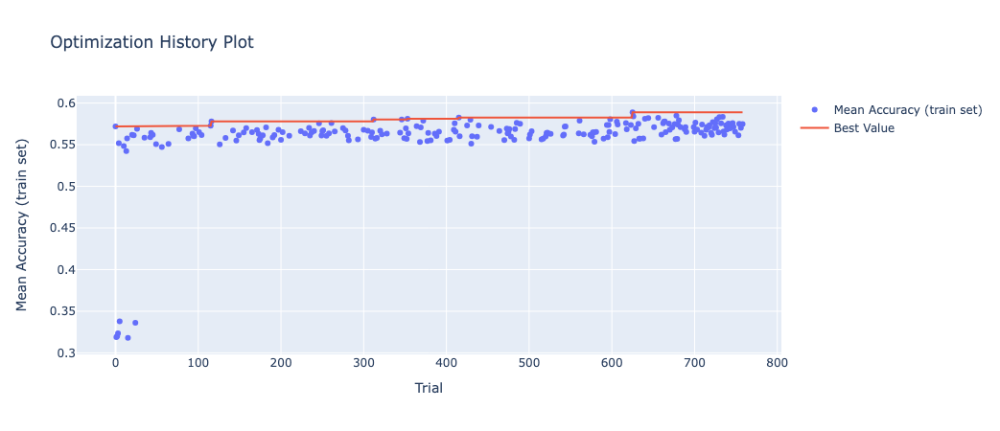
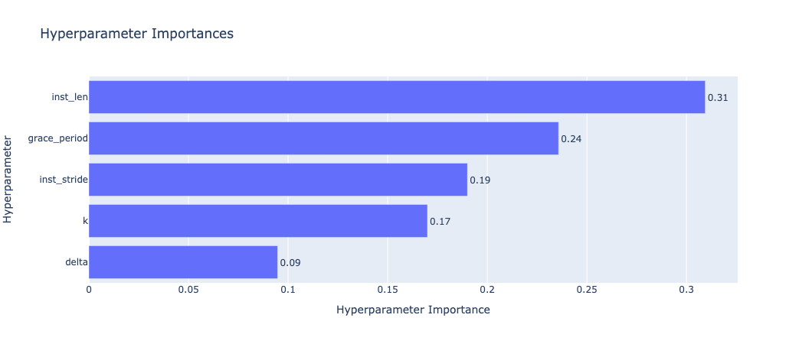
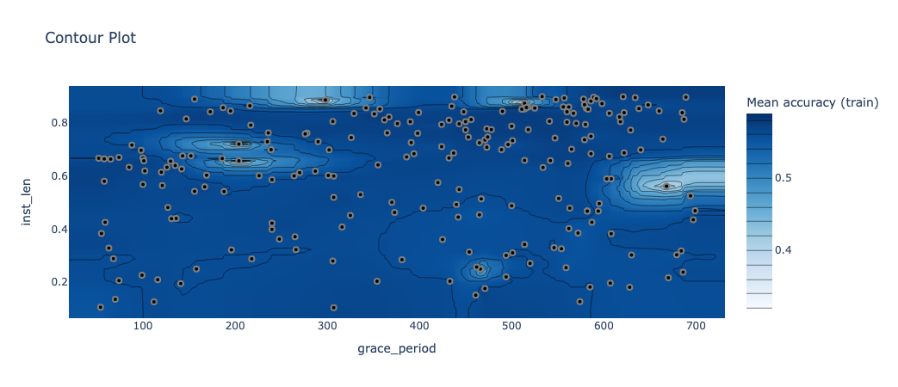
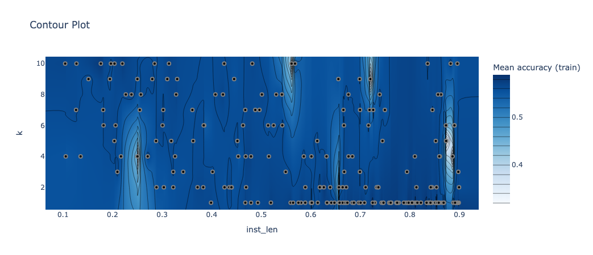
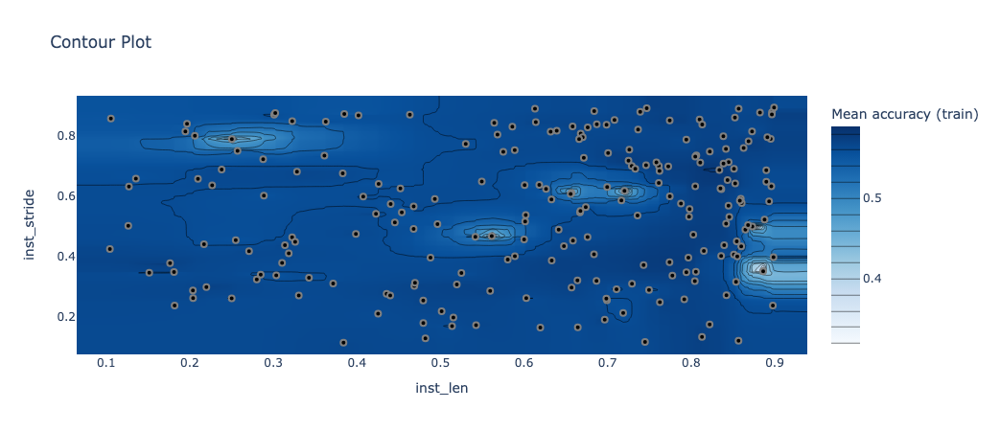

# Parameters optimization in MIHT

The study of MIHT parameters has been carried out a well-knwon systematic approach for hyperparameter optimization [1] that combines the Tree-structured Parzen Estimator (TPE) algorithm to generate combinations of parameters that maximize the objective function, with the Hyperband pruner that accelerates the search by discarding the less promising combinations. This methodology allows us to efficiently traverse the vast hyperparameter space of MLHAT, as well as to understand the importance of each hyperparameter and its influence into the final performance. The study has been implemented in Python through the [Optuna framework](https://optuna.org).

The conditions of the study are mainly given by the optimization function and the range in wich each parameter will move. The optimization function has been defined as the mean accuracy obtained across the train sets of the datasets included in this study. The datasets included here are not all the datasets of the main study due to computational and time constraints. Instead, we have chosen 12 of the datasets described in the [Datasets section](../README.md#datasets): *ArrowHead*, *AtrialFibrillation*, *Cricket*, *SelfRegulationSCP1*, *SelfRegulationSCP2*, *StandWalkJump*, *AsphaltRegularity*, *AllGestureWiimoteX*, *GesturePebbleZ2*, *PickupGestureWiimoteZ*, *AsphaltPavementTypeCoordinates*, *JapaneseVowels*. The search ranges per parameter are shown in the following table. For numerical attributes, typical ranges from the literature of Hoeffding trees have been used to delimit the search.

| Variable | Parameter | Range of search | Meaning |
|---|---|---|---|
|`inst_len` | Instance length $\omega$ | [0.1, 0.9] | Percentage of the total duration of time series to create the instances of its associated MIL bag.|
|`inst_stride` | Instance overlap $\lambda$ | [0.1, 0.9] | Percentage of the instance length $\omega$ used to define the separation between the beginning of an instance and the next one.|
|`k` | K relevant instances per bag. | [1, 10] | Number of consecutive instances to consider as relevant per bag |
|`grace_period` | Grace period of the Hoeffding tree | [50, 700] | Number of instance that a node in the tree should receive before attemp to split |
|`delta` | Hoeffding bound significance $\delta$ | [1e-7, 0.1] | Tolerance in the significance of the Hoeffding bound to accept a split.|

The optimization process was defined using the Optuna framework like:

```python
import optuna

sampler = optuna.samplers.TPESampler(multivariate=True, group=True)
pruner = optuna.pruners.HyperbandPruner(min_resource=5)
storage = optuna.storages.RDBStorage(
    url="sqlite:///results/optuna.db",
    engine_kwargs={"connect_args": {"timeout": 100}},
    failed_trial_callback=optuna.storages.RetryFailedTrialCallback(),
    heartbeat_interval=60
)
study = optuna.create_study(study_name='mi-ht', storage=storage, load_if_exists=True, direction='maximize', sampler=sampler, pruner=pruner)
study.optimize(objective, n_trials=1000, n_jobs=1)
```

The evolution of the optimization metric across the trials is shown in the following figure, showing how at the beggining of the study we started with an accuracy of around 35% that quickly evolved towards the 55% thanks to the guided search process.



The best configuration was found at the 625 trial, with a mean accuracy for the training set of 59%. This trial determined that the optimal parameters for MIHT are:
| Parameter | Value |
|---|---|
| `inst_len` | 47% of time-series length |
| `inst_stride` | 30% of `inst_len` |
| `k` | 4 |
| `grace_period` | 582 |
| `delta` | 2.51e-6 |

Moreover, we can also analyze the importance of each parameter in the performance MIHT according to the ANOVA functional framework [2], that quantifies the influence of both single hyperparameters and the interactions between them from the marginal predicted performance. The results of the analysis are shown in the following figure. These results show that the most important parameters are the instance length and the grace period used to build the tree, following by the stride between instances and the number of instances selected, and finally the significance of the Hoeffding bound.



Beyond the importance of each individual parameter, it is also interesting to know the most promising ranges. The following graphs show the main two-to-two relationships between parameters and the results obtained in the target metrics. These results show that the parameters do not work in isolation, but that different complementary combinations can obtain similar results. For example, instance length with k must complement each other to cover about 80% of the time series to obtain optimal results for the datasets considered.





## References

[1] B. Bischl, M. Binder, M. Lang, T. Pielok, J. Richter, S. Coors, J. Thomas, T. Ullmann, M. Becker, A. L. Boulesteix, D. Deng, M. Lindauer, Hyperparameter optimization: Foundations, algorithms, best practices, and open challenges, Wiley Interdisciplinary Reviews: Data Mining and Knowledge Discovery 13 (2) (2023)

[2] F. Hutter, H. Hoos, K. Leyton-Brown, An efficient approach for assessing hyperparameter importance, in: Proceedings of the 31st International Conference on Machine Learning, Vol. 2, 2014, pp. 1130–1144.
